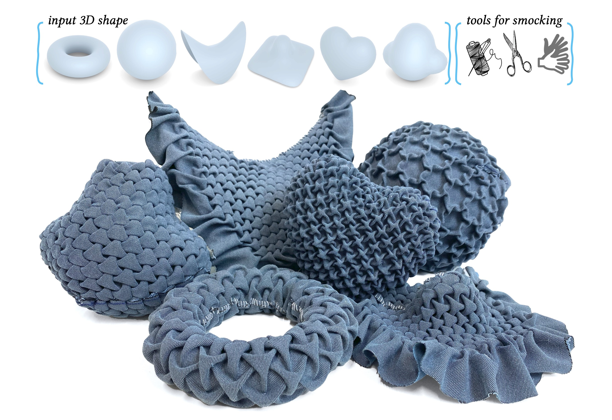

---

#####



---

##### Abstract

We present a novel method for realizing freeform surfaces with pieces of flat
fabric, where curvature is created by stitching together points on the fabric
using a technique known as smocking. Smocking is renowned for producing
intricate geometric textures with voluminous pleats. However, it has been
mostly used to realize flat shapes or manually designed, limited classes
of curved surfaces. Our method combines the computation of directional
fields with continuous optimization of a Tangram graph in the plane, which
together allow us to realize surfaces of arbitrary topology and curvature
with smocking patterns of diverse symmetries. Given a target surface and
the desired smocking pattern, our method outputs a corresponding 2D
smocking pattern that can be fabricated by sewing specified points together.
The resulting textile fabrication approximates the target shape and exhibits
visually pleasing pleats. We validate our method through physical fabrication
of various smocked examples.

---

##### Download

+ [Paper](3d_smocking_paper.pdf)
+ [Video](https://www.youtube.com/watch?v=Hg33jgn5vTg)
+ [Code and data](https://github.com/segaviv/SmockingTessellations)

---

##### Citation

```BibTeX
@article{aviv2024fabric,
title = {Fabric Tessellation: Realizing Freeform Surfaces by Smocking},
author = {Aviv Segall and Jing Ren and Amir Vaxman and Olga Sorkine-Hornung},
journal = {ACM Transaction on Graphics (SIGGRAPH 2024 issue)},
year = {2024},
volume = {43},
number = {4},
publisher = {Association for Computing Machinery},
address = {New York, NY, USA},
}
```

---

<!-- ##### Related material

+ [Presentation slides](presentation2.pdf)
 -->
