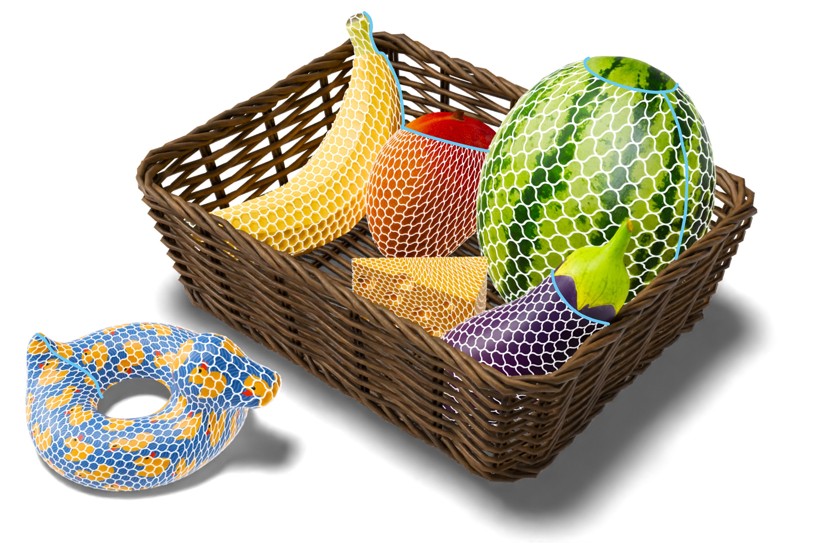

---

#####



---

##### Abstract

Distortion-minimizing surface parameterization is an essential step for computing 2D pieces necessary to fabricate a target 3D shape from flat material. Garment design and textile fabrication are a prominent application example. Common distortion measures quantify length, angle or area preservation in an isotropic manner, so that when applied to woven textile fabrication, they implicitly assume fabric behaves like paper, which is inextensible in all directions and does not permit shearing. However, woven fabric differs significantly from paper: it exhibits anisotropy along the yarn directions and allows for some degree of shearing. We propose a novel distortion energy based on Chebyshev nets that anisotropically penalizes shearing and stretching. Our energy formulation can be used as an optimization objective for surface parameterization and is simple to minimize via a local-global algorithm. We demonstrate its advantages in modeling nets or woven fabric behavior over the commonly used isotropic distortion energies.

---

##### Download

+ [Paper](chebyshev_net.pdf)
+ [Video](https://www.youtube.com/watch?v=lhTshybwd64)
+ [Code and data](https://github.com/oehria/woven-fabric-chebyshev)

---

##### Citation

```BibTeX
@article{Oehri:ChebyWoven:2024,
author = {Oehri, Annika and Segall, Aviv and Ren, Jing and Sorkine-Hornung, Olga},
title = {Chebyshev Parameterization for Woven Fabric Modeling},
journal = {ACM Transactions on Graphics},
volume = {43},
number = {6},
note = {SIGGRAPH ASIA 2024 issue},
year = {2024},
url = {https://doi.org/10.1145/3687928},
doi = {10.1145/3687928},
}
```

---

<!-- ##### Related material

+ [Presentation slides](presentation2.pdf)
 -->
