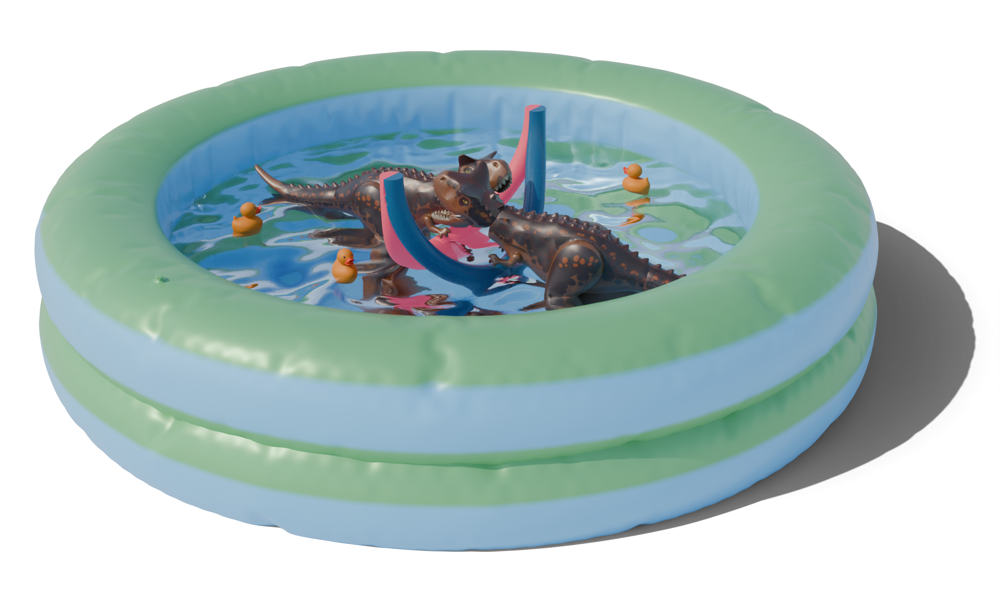

---

#####
 


---

##### Abstract

Gothic microarchitecture is a design phenomenon widely observed in late medieval European art, comprising sculptural works that emulate the forms and structural composition of monumental Gothic architecture. Despite its prevalence in preserved artifacts, the design and construction methods of Gothic microarchitecture used by artisans remain a mystery, as these processes were orally transmitted and rarely documented. The Basel goldsmith drawings (“Basler Goldschmiedrisse”), a collection of over 200 late 15th-century design drawings from the Upper Rhine region, provide a rare glimpse into the workshop practices of Gothic artisans. This collection consists of unpaired 2D drawings, including top-view and side-view projections of Gothic microarchitecture, featuring nested curve networks without annotations or explicitly articulated design principles. Understanding these 2D drawings and reconstructing the 3D objects they represent has long posed a significant challenge due to the lack of documentation and the complexity of the designs. In this work, we propose a framework of simple yet expressive geometric principles to model Gothic microarchitecture as 3D curve networks, using limited input such as historical 2D drawings. Our approach formalizes a historically informed design space, constrained to tools traditionally available to artisans–namely compass and straightedge–and enables faithful reproduction of Gothic microarchitecture that conforms to physical artifacts. Our framework is intuitive and efficient, allowing users to interactively create 3D Gothic microarchitecture with minimal effort. It bridges the gap between historical artistry and modern computational design, while also shedding light on a lost chapter of Gothic craftsmanship.

---

##### Download

+ [Paper](gothic.pdf)
+ [Video](https://www.youtube.com/watch?v=hNhnC6d3hAY)
+ [Code and data](https://github.com/llorz/SIG25_goldschmiedrisse)

---

##### Citation

```BibTeX
@article{Segall:gothic:2025,
author = {Segall, Aviv and Ren, Jing and Schwarz, Martin and Sorkine-Hornung, Olga},
title = {Computational Modeling of Gothic Microarchitecture},
booktitle = {SIGGRAPH 2025, Technical Papers},
year = {2025},
url={https://doi.org/10.1145/3721238.3730649},
doi = {10.1145/3721238.3730649},
}
```

---

<!-- ##### Related material

+ [Presentation slides](presentation2.pdf)
 -->
