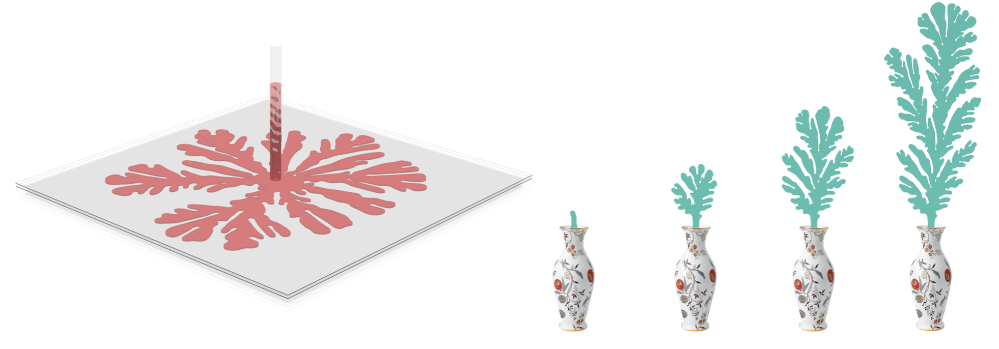

---
##### 




---

##### Abstract

Hele-Shaw flow describes the slow flow of a viscous liquid between two parallel plates separated by a small gap. In some configurations such a flow generates instabilities known as Saffman-Taylor fingers, which form intricate visual patterns. While these patterns have been an inspiration for artists, as well as thoroughly analyzed by mathematicians, efficiently simulating them remains challenging. The main difficulty involves efficiently computing a harmonic function on a time-varying planar domain, a problem which has been recently addressed in the shape deformation literature using a complex-variable formulation of generalized barycentric coordinates. We propose to leverage similar machinery, and show how the model equations for the Hele-Shaw flow can be formulated in this framework. This allows us to efficiently simulate the flow, while allowing interactive user control of the behavior of the fingers. We additionally show that complex barycentric coordinates are applicable to the exterior domain, and use them to simulate two-phase flow, yielding a variety of interesting patterns.

---

##### Download

+ [Paper](hele_shaw_simulation.pdf)
+ [Code](hele_shaw_sim.zip)

---

##### Citation

```BibTeX
@inproceedings{segall2016hele,
  title={Hele-shaw flow simulation with interactive control using complex barycentric coordinates.},
  author={Segall, Aviv and Vantzos, Orestis and Ben-Chen, Mirela},
  booktitle={Symposium on Computer Animation},
  pages={85--95},
  year={2016}
}
```

---

<!-- ##### Related material

+ [Presentation slides](presentation2.pdf)
 -->
