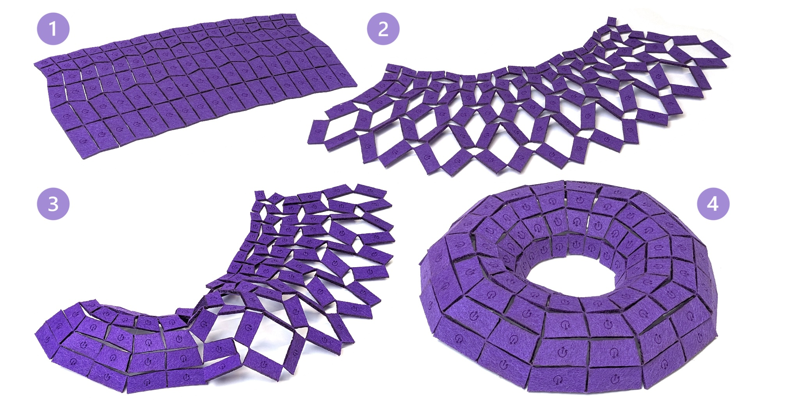

---

#####
 


---

##### Abstract

We present a computational framework for designing geometric metamaterials capable of approximating freeform 3D surfaces via rotationally deployable kirigami patterns. While prior inverse design methods typically rely on standard, well-studied patterns, such as equilateral triangles or quadrilaterals, we step back to examine the broader design space of the patterns themselves. Specifically, we derive principled rules to determine whether a given planar tiling can be cut into a rotationally deployable hinged kirigami structure with possible curvature adaptation. These insights allow us to generate and validate a broad family of novel tiling patterns beyond traditional examples. We further analyze two key deployment states of a general pattern: the commonly used maximal area expansion, and the maximal rotation angle reached just before face collisions occur, which we adopt as the default for inverse design as it allows for simple deployment in practice, i.e., rotating the faces to their natural limit. Finally, we solve the inverse problem: given a target 3D surface, we compute a planar tiling that, when cut and deployed to its maximal rotation angle, approximates the input geometry. We show that for a subset of patterns, the deployed configurations are hole-free, demonstrating that curvature can be achieved from planar sheets through local combinatorial changes. Our experiments, including physical fabrications, demonstrate the effectiveness of our approach and validate a wide range of previously unexplored patterns that are both physically realizable and geometrically expressive.

---

##### Download

+ [Paper](hinged_kirigami.pdf)
+ [Video](https://www.youtube.com/watch?v=DyvxWxhdnbg)
+ [Code and data](https://github.com/segaviv/kirigami_tessellations)
+ [Webpage & demo](https://segaviv.github.io/kirigami_tessellations/)
---

##### Citation

```BibTeX
@inproceedings{10.1145/3757377.3763895,
author = {Segall, Aviv and Ren, Jing and Padilla, Marcel and Sorkine-Hornung, Olga},
title = {Reconfigurable Hinged Kirigami Tessellations},
year = {2025},
isbn = {9798400721373},
publisher = {Association for Computing Machinery},
address = {New York, NY, USA},
url = {https://doi.org/10.1145/3757377.3763895},
doi = {10.1145/3757377.3763895},
booktitle = {Proceedings of the SIGGRAPH Asia 2025 Conference Papers},
articleno = {99},
numpages = {11},
keywords = {Computational fabrication, kirigami, surface approximation, metamaterials, inverse design},
location = {
},
series = {SA Conference Papers '25}
}
```

---

<!-- ##### Related material

+ [Presentation slides](presentation2.pdf)
 -->
