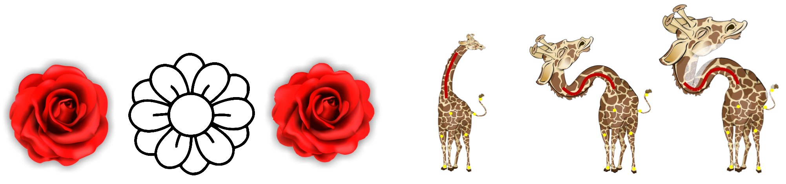

---

#####



---

##### Abstract

Conformal maps between planar domains are an important tool in geometry processing, used for shape deformation and image warping. The Riemann mapping theorem guarantees that there exists a conformal map between any two simply connected planar domains, yet computing this map efficiently remains challenging. In practice, one of the main algorithmic questions is the correspondence between the boundaries of the domains. On the one hand, there exist a number of conformal maps between any two domains, thus many potential boundary correspondences, yet on the other, given full boundary prescription a conformal map might not exist. Furthermore, an approximate boundary fitting can be enough for many applications. We therefore propose an alternating minimization algorithm for finding a boundary-approximating conformal map given only an initial global alignment of the two input domains. We utilize the Cauchy-Green complex barycentric coordinates to parameterize the space of conformal maps from the source domain, and thus compute a continuous map without requiring the discretization of the domain, and without mapping to intermediate domains. This yields a very efficient method which allows to interactively modify additional user-provided constraints, such as point-to-point and stroke-to-stroke correspondences. Furthermore, we show how to easily generalize this setup to quasi-conformal maps, thus enriching the space of mappings and reducing the area distortion. We compare our algorithm to state-of-the-art methods for mapping between planar domains, and demonstrate that we achieve less distorted maps on the same inputs. Finally, we show applications of our approach to stroke based deformation and constrained texture mapping.

---

##### Download

+ [Paper](iccm.pdf)
+ [Code](iccm.zip)

---

##### Citation

```BibTeX
@inproceedings{segall2016iterative,
  title={Iterative closest conformal maps between planar domains},
  author={Segall, Aviv and Ben-Chen, Mirela},
  booktitle={Computer Graphics Forum},
  volume={35},
  number={5},
  pages={33--40},
  year={2016},
  organization={Wiley Online Library}
}
}
```

---

<!-- ##### Related material

+ [Presentation slides](presentation2.pdf)
 -->
