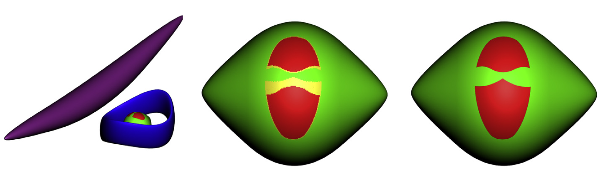

---

##### 



---

##### Abstract

Given a three dimensional object B  R3, the visual hull of B (a concept introduced by
Laurentini in 1992) is the smallest set VB  R3 containing B with the following property:
for each point p on the boundary of VB there exists a direction from which p is on a silhouette of VB. The notion of the visual hull has applications in computer graphics (visibility and
silhouette based algorithms), manufacturing (accessibility, wire EDM and hot wire cutting),
and more.
We present a tractable algorithm for computing a decomposition of a C1 smooth, closed
parametric surface S  R3, positioned in an arrangement with other occluding surfaces,
into those regions that belong to the visual hull and those that do not (later referred to
as the ‘‘line-accessible’’ or ‘‘line-inaccessible’’ regions). For efficiency, our method introduces two early domain pruning criteria, using a recursive subdivision of the parameter
domain, along with a tangent plane bounding cone: one criterion detects regions that
are guaranteed to belong to the visual hull, while the other detects regions that cannot
belong to it (both use sufficient and not necessary conditions). Only to those sub-domains
that remain after this significant domain reduction, an algebraic (subdivision based) solver
is applied, to solve two sets of algebraic equations, already presented by Laurentini in 1999,
gaining one to two orders of magnitude improvement in the computation times. We
provide a derivation of these equations via a different approach, compared to Laurentini
in 1999, using the model we refer to as the dynamic SSI solution of the surface and the
moving tangent plane. Concrete computational examples are provided as well.

---

##### Download

+ [Paper](https://www.sciencedirect.com/science/article/pii/S1524070314000216?via%3Dihub)

---

##### Citation

```BibTeX
@article{segall2014line,
  title={Line accessibility of free form surfaces},
  author={Segall, Aviv and Mizrahi, Jonathan and Kim, Yong Joon and Elber, Gershon},
  journal={Graphical models},
  volume={76},
  number={5},
  pages={301--311},
  year={2014},
  publisher={Elsevier}
}
```

---

<!-- ##### Related material

+ [Presentation slides](presentation1.pdf)
+ [Dissertation title](https://escholarship.org/uc/item/7jr3m96r) – PhD dissertation on which this paper is based.
+ [Column title](https://cep.lse.ac.uk/pubs/download/cp365.pdf) – Nontechnical column describing the paper. -->

