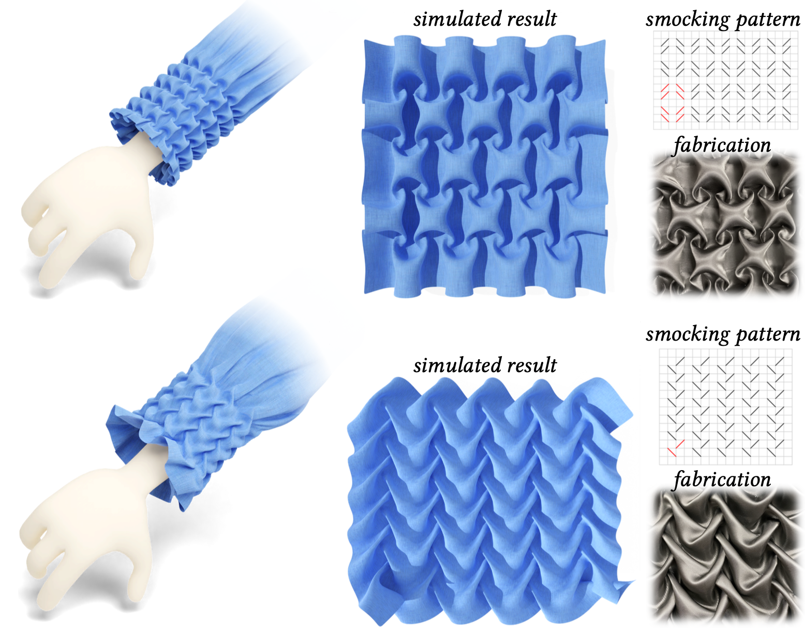

---

##### Figure 1: Example of a smocking pattern, the fabricated result and our simulation.



---

##### Abstract

We develop an optimization-based method to model smocking, a surface embroidery technique that provides decorative geometric texturing while maintaining stretch properties of the fabric. During smocking, multiple pairs of points on the fabric are stitched together, creating non-manifold geomet- ric features and visually pleasing textures. Designing smocking patterns is challenging, because the outcome of stitching is unpredictable: the final tex- ture is often revealed only when the whole smocking process is completed, necessitating painstaking physical fabrication and time consuming trial-and- error experimentation. This motivates us to seek a digital smocking design method. Straightforward attempts to compute smocked fabric geometry us- ing surface deformation or cloth simulation methods fail to produce realistic results, likely due to the intricate structure of the designs, the large number of contacts and high-curvature folds. We instead formulate smocking as a graph embedding and shape deformation problem. We extract a coarse graph representing the fabric and the stitching constraints, and then derive the graph structure of the smocked result. We solve for the 3D embedding of this graph, which in turn reliably guides the deformation of the high-resolution fabric mesh. Our optimization based method is simple, efficient, and flexible, which allows us to build an interactive system for smocking pattern explo- ration. To demonstrate the accuracy of our method, we compare our results to real fabrications on a large set of smocking patterns.

---

##### Download

+ [Paper](smocking_apper.pdf)
+ [Code and data](https://github.com/llorz/SmockingDesign)

<!-- ---

##### Citation

```BibTeX
@inproceedings{segall2016iterative,
  title={Iterative closest conformal maps between planar domains},
  author={Segall, Aviv and Ben-Chen, Mirela},
  booktitle={Computer Graphics Forum},
  volume={35},
  number={5},
  pages={33--40},
  year={2016},
  organization={Wiley Online Library}
}
}
``` -->

---

<!-- ##### Related material

+ [Presentation slides](presentation2.pdf)
 -->
